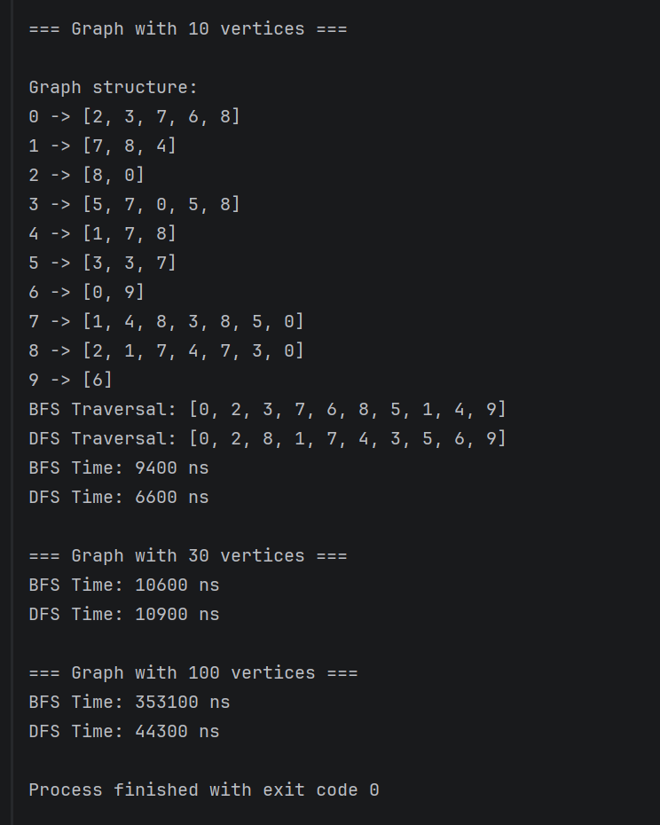

# Assignment 4: Graph Traversal and Representation System

## Project Overview

This project implements a graph representation system using an adjacency list.  
A graph consists of vertices and edges. A vertex represents a node in the graph, while an edge represents a connection between two vertices.

The project includes two main graph traversal algorithms:

- Breadth-First Search (BFS)
- Depth-First Search (DFS)

BFS explores the graph level by level using a queue. DFS explores as deeply as possible before backtracking.

## Class Descriptions

### Vertex

The Vertex class represents a single node in the graph.  
Each vertex has a unique ID.

### Edge

The Edge class represents a connection between two vertices.  
It stores the source vertex and the destination vertex.

### Graph

The Graph class stores the graph using an adjacency list.  
An adjacency list is a dictionary where each vertex stores a list of its neighboring vertices.

This representation is memory efficient and works well for sparse graphs.

### Experiment

The Experiment class runs BFS and DFS traversals and measures their execution time using time.perf_counter_ns().

## Algorithm Descriptions

## Breadth-First Search

Breadth-First Search visits vertices level by level.  
It starts from a selected vertex, visits all of its neighbors, and then continues with the next level of neighbors.

### Steps

1. Add the starting vertex to a queue.
2. Mark it as visited.
3. Remove a vertex from the queue.
4. Visit all unvisited neighbors.
5. Repeat until the queue is empty.

### Use Cases

BFS is useful for:

- Finding the shortest path in an unweighted graph
- Level-order traversal
- Social network analysis

### Time Complexity

The time complexity of BFS is:

O(V + E)

Where:

- V is the number of vertices
- E is the number of edges

## Depth-First Search

Depth-First Search explores the graph by going as deep as possible before backtracking.  
It can be implemented using recursion or a stack.

### Steps

1. Start from a selected vertex.
2. Mark it as visited.
3. Visit an unvisited neighbor.
4. Continue recursively.
5. Backtrack when no unvisited neighbors remain.

### Use Cases

DFS is useful for:

- Detecting cycles
- Path finding
- Topological sorting
- Exploring connected components

### Time Complexity

The time complexity of DFS is also:

O(V + E)

## Experimental Results

The program tests graphs with different sizes:

| Graph Size | BFS Time | DFS Time |
|---|---------:|---------:|
| 10 vertices |     9400 |     6600 |
| 30 vertices |    10600 |    10900 |
| 100 vertices |   353100 |    44300 |

## Observations

As the graph size increases, the execution time of both BFS and DFS also increases.  
This happens because both algorithms need to visit vertices and edges.

In most cases, BFS and DFS have similar performance because they have the same time complexity: O(V + E).  
However, the actual execution time can be slightly different depending on graph structure and implementation details.

## Analysis Questions

### How does graph size affect BFS and DFS performance?

Larger graphs usually require more time to traverse because there are more vertices and edges to visit.

### Which traversal is faster in your experiments?

The faster traversal may differ between tests. In some cases, DFS can be slightly faster because it uses recursion. In other cases, BFS can be faster depending on the graph structure.

### Do results match the expected complexity O(V + E)?

Yes, the results match the expected complexity. Both BFS and DFS visit each vertex and edge at most once.

### How does graph structure affect traversal order?

Graph structure affects the order in which vertices are visited.  
BFS visits vertices by levels, while DFS goes deep into one path before backtracking.

### When is BFS preferred over DFS?

BFS is preferred when we need to find the shortest path in an unweighted graph or explore nodes level by level.

### What are the limitations of DFS?

DFS does not always find the shortest path.  
It can also go very deep, which may cause recursion depth problems in large graphs.

In this project, I learned how graphs can be represented using an adjacency list. I also learned how BFS and DFS work and how they visit vertices in different orders.

The main difference between BFS and DFS is their traversal strategy. BFS explores level by level using a queue, while DFS explores deeply using recursion. One challenge was understanding how visited vertices prevent the algorithm from repeating nodes.